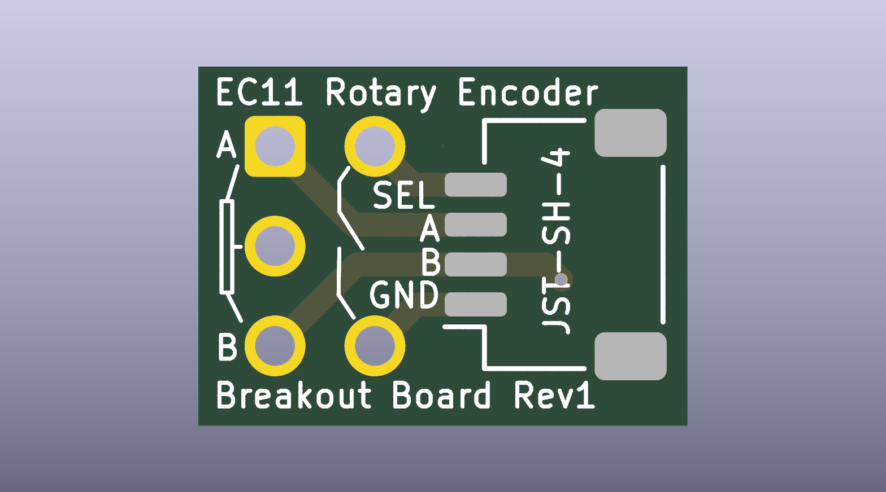
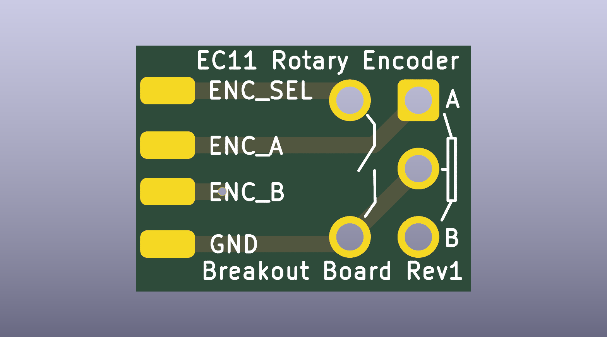
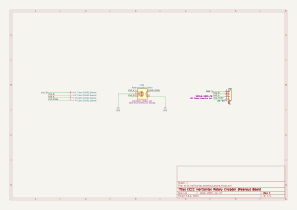

# kicad_useful_pcbs
various small pcb boards that may be of use for various projects

## Ec11 Horizontal Breakout Board

- [schematic pdf](ec11_horizontal_breakout_board/ec11_horizontal_breakout_board.pdf)

- [fabrication gerber and drills files](ec11_horizontal_breakout_board/ec11_horizontal_breakout_board_fabrication.zip)
