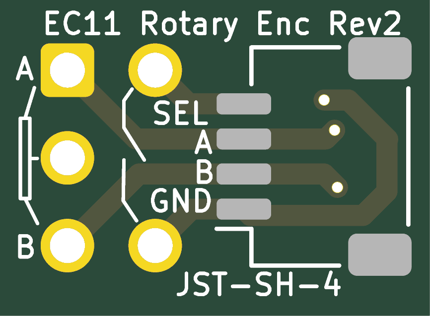
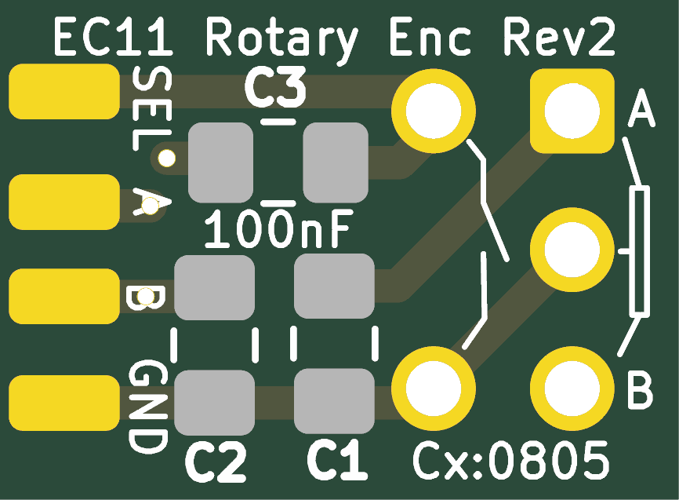
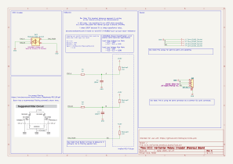

# kicad_useful_pcbs

Various small pcb boards that may be of use for various projects

## Ec11 Horizontal Breakout Board

This was created for https://github.com/mofosyne/roTec_pcb to make it easier to attach an encoder and also have some debouncing.

- [Schematic PDF](ec11_horizontal_breakout_board/documentation/ec11_horizontal_breakout_board_schematic.pdf)
- [Bill of Materials](ec11_horizontal_breakout_board/documentation/ec11_horizontal_breakout_board_bom.csv)
- [Fabrication File](ec11_horizontal_breakout_board/ec11_horizontal_breakout_board_fabrication.zip)
